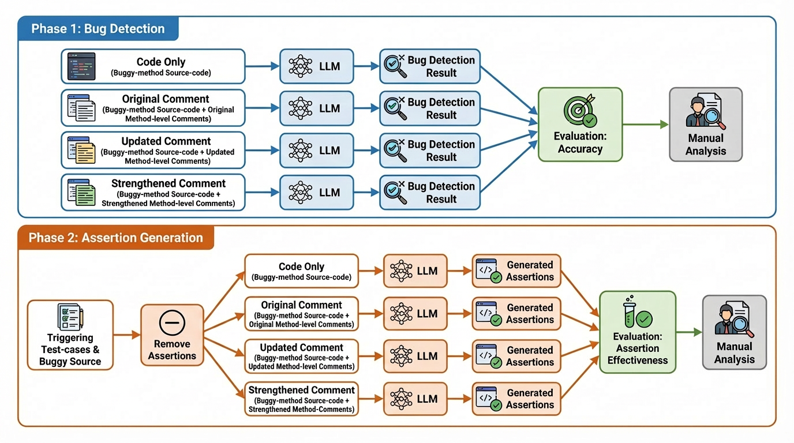
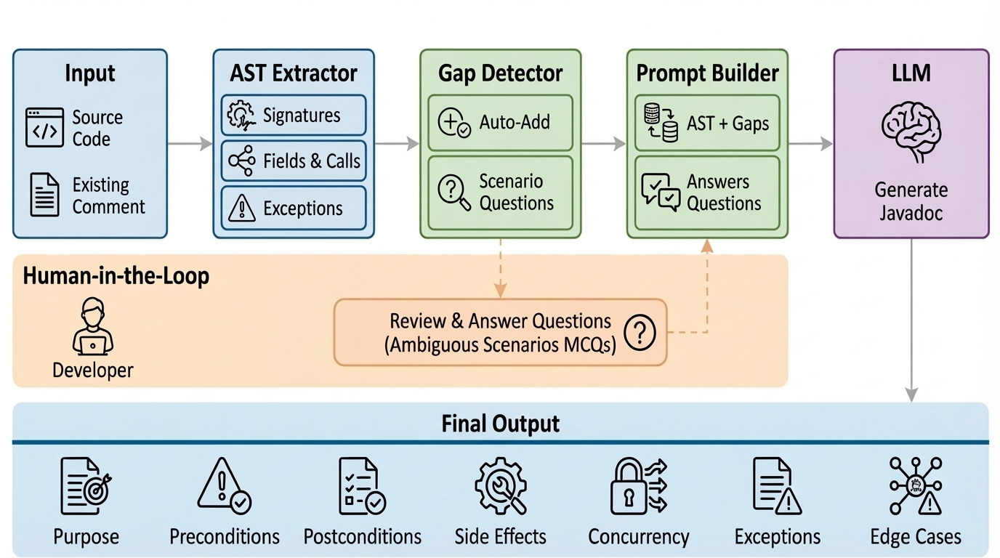

# Replication Package: Comment-Aware LLM Bug Detection and Test Oracle Generation

This repository contains the complete replication package for the paper:

**On the Role of Code Comments in Test Oracle Generation: Empirical Analysis and Human-in-the-Loop Augmentation**

It provides datasets, scripts, and system components to reproduce experiments on:

- LLM-based bug detection  
- LLM-based test oracle (assertion) generation  
- Comment Strengthener framework  

---

# Overview

Large language models rely on source code and comments to infer program behavior. However, comments are often incomplete or misaligned with implementation, which affects reasoning quality.

This repository evaluates four documentation conditions:

- **M1**: Code only  
- **M2**: Code + original comment  
- **M3**: Code + updated comment  
- **M4**: Code + strengthened comment  

The strengthened comments are generated using a human-in-the-loop pipeline grounded in program analysis.

---

## Experimental Workflow

<p align="center">
  
</p>

<p align="center">
  <em>Figure: Experimental design for bug detection and assertion generation across documentation conditions.</em>
</p>

---

# Repository Structure

## Comment Strengthener System

```
Comments_strengthener/
├── ast_extractor/
├── gap_detector/
├── prompt_builder/
├── llm/
├── orchestrator/
│   └── run_strengthen.py
├── utils/
├── results/
└── requirements.txt
```

### Description

- **ast_extractor**: Extracts structural facts from Java methods  
- **gap_detector**: Identifies missing behavioral information  
- **prompt_builder**: Constructs structured prompts  
- **llm**: Handles model interaction  
- **orchestrator**: Runs the full pipeline  
- **utils**: Data handling and preprocessing  

---

## Comment Strengthener Pipeline

<p align="center">
  
</p>

<p align="center">
  <em>Figure: Contract-oriented comment generation pipeline with AST extraction, gap detection, human-in-the-loop clarification, and LLM-based generation.</em>
</p>

### Output

Generates contract-oriented Javadoc with:

- Purpose  
- Preconditions  
- Postconditions  
- Side effects  
- Exceptions  
- Concurrency  
- Edge cases  

---

## Bug Detection Pipeline

```
bug_detection/
├── strengthened_comments_full.json
├── llm_bug_analysis_final_step2_3_pre_postfix_strengthener_comments.py
├── llm_analyzed_*.json
```

### Task

Given a Java method, the model predicts:

```json
{
  "method_is_buggy": "Yes" or "No",
  "buggy_code_lines": "...",
  "rationale": "..."
}
```

### Evaluation

- All prefix methods are labeled buggy  
- Metric: **Detection Rate**

Detection Rate = predicted buggy / total  

---

## Assertion Generation Pipeline

```
assertion_generation/
├── llm_test_oracle_generation_step4_5.py
├── llm_generated_oracles_*.json
├── build_evaluation_merged_input.py
├── evaluate_assertion_effectiveness.py
├── evaluation_merged.json
├── effectiveness_detailed.json
```

---

# Pipeline Overview

```
Dataset → Comment Strengthener → Bug Detection
Dataset → Assertion Generation → Execution → Effectiveness
```

---

# Documentation Conditions

| Mode | Description |
|------|------------|
| M1 | Code only |
| M2 | Code + original comment |
| M3 | Code + updated comment |
| M4 | Code + strengthened comment |

All conditions use identical prompts and model settings. Only documentation varies.

---

# Bug Detection Process

**Input**
- Prefix (buggy) method  
- Optional documentation  

**Prompt**
- Fixed structure  
- JSON output format  

**Model**
- DeepSeek Coder  
- Greedy decoding  

**Output**
- Binary prediction  
- Bug localization  
- Rationale  

---

# Assertion Generation Process

**Input**
- Assertion-free test  
- Focal method  
- Documentation condition  

**Model Output**
- JUnit assertion statements only  

---

# Assertion Effectiveness Evaluation

Execution-based evaluation:

1. Insert assertion into test  
2. Execute on:
   - Buggy version  
   - Fixed version  

## Effective Assertion

An assertion is **EFFECTIVE** if:

- Fails on buggy version  
- Passes on fixed version  

---

## Outcome Categories

- EFFECTIVE  
- INEFFECTIVE_PASS_BOTH  
- INEFFECTIVE_FAIL_BOTH  
- INEFFECTIVE_PASS_BUGGY_FAIL_FIXED  
- COMPILE_ERROR  
- RUNTIME_ERROR  
- EMPTY_ASSERTION  

---

# Key Results

## Bug Detection Accuracy

- M1: 84.3%  
- M2: 87.0%  
- M3: 85.7%  
- M4: 91.9%  

## Assertion Effectiveness

- M1: 63.68%  
- M2: 70.40%  
- M3: 68.16%  
- M4: 73.99%  

---

# Running the System

## 1. Comment Strengthener

```bash
python orchestrator/run_strengthen.py \
  --input dataset.json \
  --output results.json \
  --mode contract
```

---

## 2. Bug Detection

```bash
python llm_bug_analysis_final_step2_3_pre_postfix_strengthener_comments.py
```

---

## 3. Assertion Generation

```bash
python llm_test_oracle_generation_step4_5.py
```

---

## 4. Build Evaluation Input

```bash
python build_evaluation_merged_input.py \
  --output evaluation_merged.json
```

---

## 5. Evaluate Effectiveness

```bash
python evaluate_assertion_effectiveness.py \
  --input evaluation_merged.json \
  --output-dir results
```

---

# Requirements

- Python 3  
- Java + Maven or Gradle  
- LLM API access  
- Local project repositories  

---

# Design Principles

- Code is treated as ground truth  
- Human input is used only for ambiguous cases  
- Documentation is transformed into structured contracts  

These principles ensure alignment between implementation and documentation and improve LLM reasoning.

---

# Limitations

- Dataset limited to Java  
- Requires execution environment for full evaluation  
- Results may vary across LLM providers  

---

# Citation

If you use this repository, cite:

**On the Role of Code Comments in Test Oracle Generation: Empirical Analysis and Human-in-the-Loop Augmentation**
