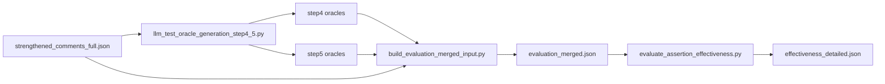

# Replication Package: LLM Test Oracle Generation & Assertion Effectiveness

This directory contains **paper artifacts**, **datasets**, and **scripts** used to (1) generate test assertions under four documentation conditions and (2) evaluate **assertion effectiveness** by executing tests on buggy vs. fixed code. Use it as a **GitHub replication package** alongside the paper; large source repositories are **not** bundled here.

---

## Contents

| Item | Description |
|------|-------------|
| `strengthened_comments_full.json` | Primary dataset: bug reports, focal methods (prefix/postfix), assertion-free tests, strengthened comments, etc. |
| `llm_generated_oracles_step4_without_comments_deepseek_hybrid_balanced.json` | Generated assertions — **M1: code only** (no method Javadoc in prompt). |
| `llm_generated_oracles_step5_with_comments_deepseek_hybrid_balanced.json` | Generated assertions — **M2: original comment** (buggy-version Javadoc + buggy body). |
| `llm_generated_oracles_step5_with_postfix_comments_deepseek_hybrid_balanced.json` | Generated assertions — **M3: updated comment** (fixed-version Javadoc + fixed body). |
| `llm_generated_oracles_step5_with_strengthened_comments_deepseek_hybrid_balanced.json` | Generated assertions — **M4: strengthened comment** (structured contract + buggy body). |
| `evaluation_merged.json` | One record per bug: assertion-free test + `generated_assertions_by_mode` for all modes present. |
| `effectiveness_detailed.json` | Per-instance outcomes (`per_instance`) and summary counts (`aggregate`) per mode. |
| `llm_test_oracle_generation_step4_5.py` | Pipeline to **call the LLM** and produce oracle JSON files. |
| `build_evaluation_merged_input.py` | Merges the dataset + four oracle files into `evaluation_merged.json`. |
| `evaluate_assertion_effectiveness.py` | Inserts assertions, runs tests on buggy/fixed projects, assigns **outcome** labels. |

---

## Conceptual pipeline



Re-running the full pipeline requires **LLM API access**, **local clones** of subject projects at the correct commits, and matching **Java/Maven (or Gradle)** environments.

---

## How assertions are generated (four modes)

The generator script `llm_test_oracle_generation_step4_5.py` reads `strengthened_comments_full.json` (or an equivalent dataset) and, for each **bug instance**, builds a prompt that includes:

- the **assertion-free** triggering test body (or equivalent field used by the script), and  
- the **focal method** under one of four **analysis modes** (`--mode`):

| Mode flag | Paper label | What the model sees |
|-----------|-------------|---------------------|
| `step4_without_comments` | **M1 — code only** | `buggy_method_sourcecode` (method body **without** Javadoc). |
| `step5_with_comments` | **M2 — original comment** | Prefix method + **comment from the buggy version** (original Javadoc + buggy behavior). |
| `step5_with_postfix_comments` | **M3 — updated comment** | Prefix method + **comment from the fixed version** (postfix Javadoc) paired with **fixed** implementation in the prompt as defined by the pipeline (see paper for exact pairing). |
| `step5_with_strengthened_comments` | **M4 — strengthened comment** | Prefix method + **LLM-generated strengthened** contract-style Javadoc (from `strengthened_comments` in the dataset) + buggy body. |

**Prompt style:** The shipped artifacts use the **`hybrid_balanced`** variant (see script `PROMPT_VARIANTS` and paper). Other styles can be selected via `--prompt_style`.

**LLM backend:** `--model` supports backends such as `deepseek` / `openai` (see script and environment variables for API keys).

**Output shape:** Each oracle file is a JSON **array** of entries. Generated assertions are stored under:

```text
generated_oracle.generated_assertions
```

**Dependency:** `llm_test_oracle_generation_step4_5.py` imports `comment_gating_preprocessor` (used for some prompt variants). Place `comment_gating_preprocessor.py` on `PYTHONPATH` or run from the repository root that contains it.

---

## Building the merged evaluation input

`build_evaluation_merged_input.py` aligns rows by `bug_report.bug_id` and produces `evaluation_merged.json`:

- **Dataset** supplies `test_case_without_assertions` (copied to `assertion_free_test_code`).
- Each oracle file supplies one string per `bug_id` for `generated_oracle.generated_assertions`.

**Mapping from oracle files to mode keys:**

| Oracle input | Key in `generated_assertions_by_mode` |
|--------------|---------------------------------------|
| step4 (without comments) | `code_only` |
| step5 with comments | `original_comment` |
| step5 with postfix comments | `updated_comment` |
| step5 with strengthened comments | `strengthened_comment` |

Example:

```bash
python build_evaluation_merged_input.py ^
  --dataset strengthened_comments_full.json ^
  --oracle-code-only llm_generated_oracles_step4_without_comments_deepseek_hybrid_balanced.json ^
  --oracle-original llm_generated_oracles_step5_with_comments_deepseek_hybrid_balanced.json ^
  --oracle-updated llm_generated_oracles_step5_with_postfix_comments_deepseek_hybrid_balanced.json ^
  --oracle-strengthened llm_generated_oracles_step5_with_strengthened_comments_deepseek_hybrid_balanced.json ^
  --output evaluation_merged.json
```

*(Use `\` line continuation on Unix.)*

---

## How assertion effectiveness is evaluated

`evaluate_assertion_effectiveness.py` implements an **execution-based** definition aligned with the paper:

1. **Insert** the generated assertion string into the assertion-free test body (before the closing `}` of the test method).
2. **Compile** and **run** the test **twice**:
   - on the **buggy** (prefix) program version, and  
   - on the **fixed** (postfix) program version.
3. Record whether the test **passes** or **fails** on each version (with optional handling for compile errors, empty assertions, timeouts, etc.).

### Primary outcome: effective oracle

An instance is **EFFECTIVE** when:

- the test **runs** on both versions (no compile failure in the evaluation path used), and  
- **`buggy_passed` is false** (test fails on the buggy version — the oracle “detects” the fault), and  
- **`fixed_passed` is true** (test passes on the fixed version — the oracle accepts the repair).

This matches the intended semantics: **fail on buggy, pass on fixed**.

### Other outcome labels (summary)

The script defines additional categories such as:

- `INEFFECTIVE_PASS_BOTH` — passes on both buggy and fixed (weak / non-discriminating).  
- `INEFFECTIVE_FAIL_BOTH` — fails on both (often too strict or wrong expectation).  
- `INEFFECTIVE_PASS_BUGGY_FAIL_FIXED` — passes on buggy but fails on fixed (undesirable).  
- `COMPILE_ERROR`, `RUNTIME_ERROR`, `NOT_EVALUATED`, `EMPTY_ASSERTION` — as documented in the script header.

Exact classification logic is in the script (see `outcome` assignment after `buggy_passed` / `fixed_passed`).

### Running the evaluator

Evaluation requires **project paths** for buggy and fixed checkouts (or equivalent hooks in `ProjectRunner`). The script supports merged input:

```bash
python evaluate_assertion_effectiveness.py --input evaluation_merged.json --output-dir results
```

See the script docstring for `--dataset` + `--oracles` mode, coverage options, and Maven/Gradle integration.

---

## `effectiveness_detailed.json` structure

- **`per_instance`**: one row per (`bug_id`, `mode`) with `outcome`, `compiles`, `buggy_passed`, `fixed_passed`, and a short `message`.  
- **`aggregate`**: counts per mode (totals, `EFFECTIVE`, and other outcome buckets).  

**Assertion effectiveness rate** in the paper is typically **EFFECTIVE count ÷ total** per mode (after filtering to evaluated instances), unless otherwise stated.

---

## Replication checklist

1. **Python 3** + dependencies used by the scripts (`requests`, etc.).  
2. **Java + Maven** (or adapt `ProjectRunner` for Gradle).  
3. **Local clones** of subject repositories at commits referenced by `bug_report.bug_id` (or your provided `project_paths` mapping).  
4. **LLM API** credentials if regenerating oracles (not needed to re-analyze shipped JSON).  
5. Place **`comment_gating_preprocessor.py`** where `llm_test_oracle_generation_step4_5.py` can import it.

---

## Scope and limitations

- This package **includes** datasets and scripts as used for the study; it does **not** include full GitHub mirrors of Jenkins, Hadoop, Guava, etc.  
- **Reproducing** exact execution outcomes may require matching **JDK**, **Maven**, and **project-specific** test harness details.  
- Shipped `effectiveness_detailed.json` reflects the evaluation run **frozen** for the paper; re-running the evaluator may differ slightly if environment or tooling changes.

---

## Citation

If you use this package, cite the associated paper and this replication artifact (repository URL, version tag, and commit hash once published).
